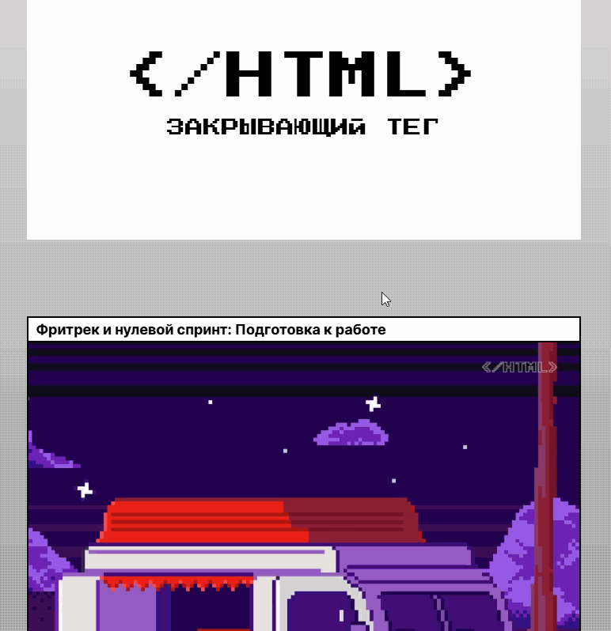

<h1 align="center">Hi there, I'm <a href="https://github.com/eeugene152/" target="_blank">Eugene Emelkhovsky</a> 
</h1>
<h3 align="center">Front learner from Russia 🇷🇺</h3>

# Проект «Закрывающий тег» — описание:
«Закрывающий тег» — это итоговый проект, объединяющий все изученные технологии: от базовой семантики до сложных CSS-анимаций и векторной графики.
## Адрес на GIT
### https://github.com/eeugene152/zakrivayuschiy-teg-f

## Cтраница с проектом доступна -
### https://eeugene152.github.io/zakrivayuschiy-teg-f/

Мой четвертый проект в рамках обучения веб-разработке - **Финальная работа курса HTML/CSS**.

## 🛠 Что нового в этом проекте (Advanced CSS)

**В отличие от предыдущих работ, здесь применены продвинутые техники:**

- **Сложные CSS-фильтры:** Каждая карточка в галерее имеет уникальное состояние, реализованное через filter (blur, hue-rotate, grayscale, invert и их комбинации).
- **Интерактивные SVG:** Реализована сложная многослойная анимация иконки сердца (поэтапная заливка контура, тела и центральной части + вылетающие «искры»).
- **Режимы наложения (Blend Modes):** Использован mix-blend-mode: difference для создания эффекта инверсии текста на кнопках при наведении.
- **Диалоговые окна:** Использование нативного тега <dialog> с кастомной стилизацией бэкдропа и управлением через JS API.

## 🏗 Ключевые технологии

- **Семантический HTML5:** Использование списка `<ul>/<li>` для карточек, что критично для доступности (A11y).
- **Продвинутая адаптивность:**
    - Функция clamp() для плавной типографики и отступов.
    - Современный синтаксис медиазапросов (Range Syntax: width >= 1440px).
    - Логические свойства (margin-block, inline-size) для гибкой верстки.
    - Векторный спрайт: Оптимизация повторяющихся элементов (дискета) через <symbol> и <use>.

## 🎓 Чему я научился за этот курс

- **Pixel Perfect & Сетки:** Верстка сложного асимметричного макета с использованием Flexbox и Grid Layout.
- **Анимации:** Создание сложных @keyframes анимаций и управление ими через состояния :hover, :active и :focus-visible.
- **Графика:** Глубокая работа с SVG (инлайновое использование путей для CSS-анимации) и оптимизация растровых изображений (loading="lazy", object-fit).
- **Валидация и кодстайл:** Написание чистого, валидного кода, проходящего строгую проверку W3C.

### [Посмотреть проект на GitHub](https://github.com/eeugene152/zakrivayuschiy-teg-f)
# Авторство:
- Яндекс Практикум (https://practicum.yandex.ru/)
- GitHub: [@eeugene152](https://github.com/eeugene152/)
- Telegram: [@eemelkhovsky](https://t.me/eemelkhovsky/)

-----
*Проект выполнен в учебных целях.*
